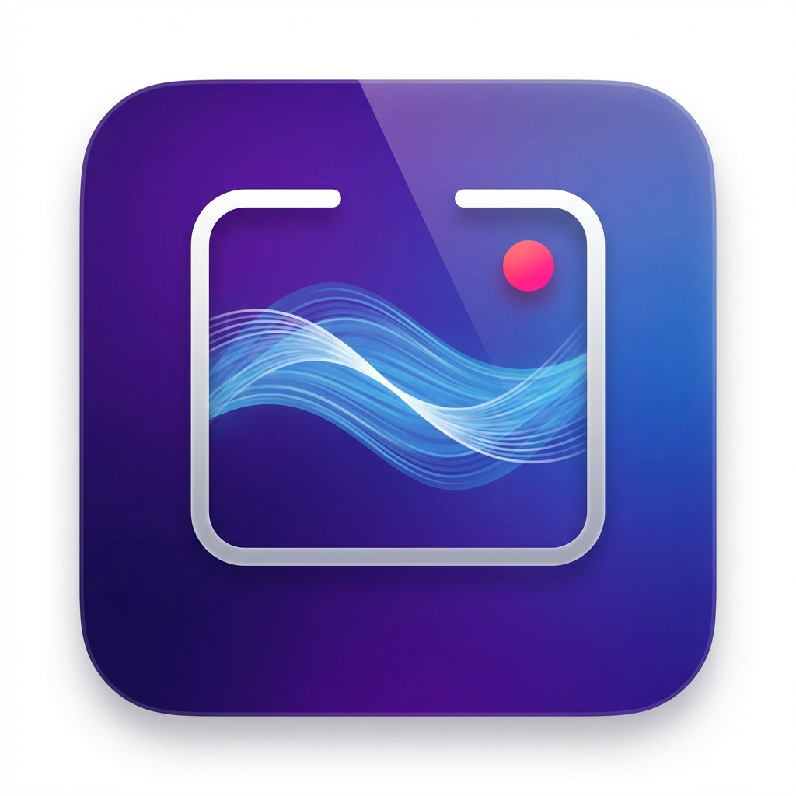

# 🌊 VibeFlow

**VibeFlow** is a cinematic screen recording tool built for the "Vibe Coding" era. It transforms your raw screen captures into professionalapp demos instantly with beautiful backgrounds, smooth animations, and synchronized audio.



## ✨ Features

- **Cinematic Focus Zoom**: Intelligent camera transitions that follow your cursor with a stable, drift-free "Focus Lock".
- **Live Canvas Preview**: Adjust padding, corner radius, and shadows in real-time.
- **Dynamic Backgrounds**: Switch between Solid Colors, Linear Gradients, or any custom Image background.
- **Synchronized Audio Engine**: High-fidelity microphone recording mixed perfectly with system audio.
- **Custom Save Directory**: Choose exactly where your recordings are saved.
- **Pro Performance**: Launchable from Spotlight and optimized for macOS 13+.

## 🚀 Installation & Usage

### Method 1: Download the Release (Recommended)
1. Go to the [Releases](https://github.com/SambhavSirohi05/VibeFlow/releases) page.
2. Download `VibeFlow.dmg`.
3. Open the DMG and drag **VibeFlow** to your **Applications** folder.

> [!IMPORTANT]
> **First Time Opening:**
> Since this app is independently developed, macOS may show a "damaged" or "unidentified developer" warning. 
> 
> **To fix this:**
> 1. Open your Terminal.
> 2. Run this command: `xattr -cr /Applications/VibeFlow.app`
> 3. **Right-click** VibeFlow in your Applications folder and select **Open**. 
> You only need to do this once!

### Method 2: Build from Source
If you have Swift installed:
```bash
git clone https://github.com/SambhavSirohi05/VibeFlow.git
cd VibeFlow
swift run
```

---

Built with ❤️ by [Sambhav Sirohi](https://github.com/SambhavSirohi05)
